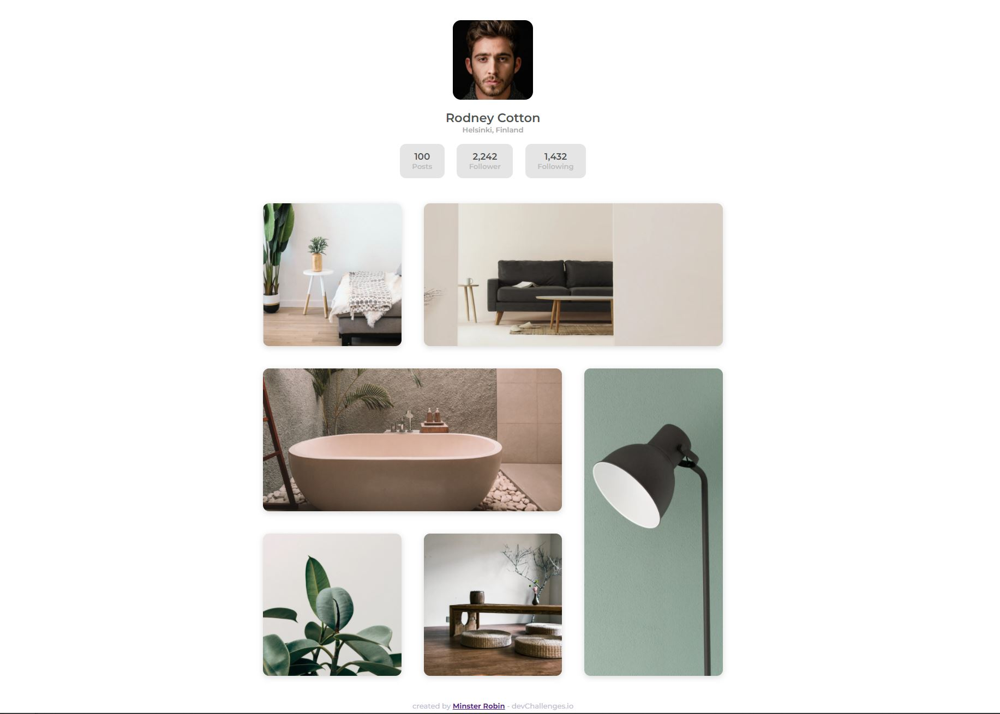

<!-- Please update value in the {}  -->

<h1 align="center">My Gallery</h1>

   Solution for a challenge from  <a href="http://devchallenges.io" target="_blank">Devchallenges.io</a>.

  <h3>
    <a href="https://my-gallery-sandy.vercel.app/">
      Demo
    </a>
     | 
    <a href="https://devchallenges.io/solutions/J3ELgRq2I5YElK7mRtgb">
      Solution
    </a>
     | 
    <a href="https://devchallenges.io/challenges/gcbWLxG6wdennelX7b8I">
      Challenge
    </a>
  </h3>

<!-- TABLE OF CONTENTS -->

## Table of Contents

- [Overview](#overview)
  - [Built With](#built-with)
- [Features](#features)
- [Contact](#contact)
- [Acknowledgements](#acknowledgements)

<!-- OVERVIEW -->

## Overview

### Built With

<!-- This section should list any major frameworks that you built your project using. Here are a few examples.-->

- [Vue.js](https://vuejs.org/)
- [SCSS](https://sass-lang.com/)

## Acknowledgements

<!-- This section should list any articles or add-ons/plugins that helps you to complete the project. This is optional but it will help you in the future. For exmpale -->

- [Vue.js documentation](https://v3.vuejs.org/guide/introduction.html)
- [Sass documentation](https://sass-lang.com/documentation)

## Contact

- Website [robin-minster.fr](https://robin-minster.fr/)
- GitHub [@MinsterRobin](https://github.com/MinsterRobin)
